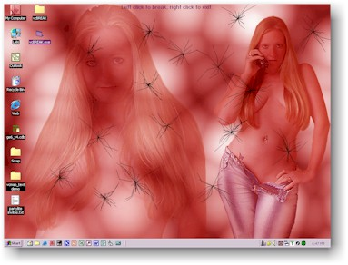



## Shatter Desktop

### Description

This code will not change the world, nor will it impress many. Just made it for fun real quick. Uses an old class module I have for doing screen captures and also demostrates how to play a WAV file from the custom resource section of a resource file. Just wanted something to have handy to break the screen if/when I get mad at some code. KEYWORDS: CAPTURE, WAV, JOKE, FUN, LOADRESDATA, RESOURCE.
 
### More Info
 

             |
---                |---
**Submitted On**   |2002-12-19 18:44:48
**By**             |[Clint LaFever](https://github.com/Planet-Source-Code/PSCIndex/blob/master/ByAuthor/clint-lafever.md)
**Level**          |Beginner
**User Rating**    |5.0 (10 globes from 2 users)
**Compatibility**  |VB 6\.0
**Category**       |[Jokes/ Humor](https://github.com/Planet-Source-Code/PSCIndex/blob/master/ByCategory/jokes-humor__1-40.md)
**World**          |[Visual Basic](https://github.com/Planet-Source-Code/PSCIndex/blob/master/ByWorld/visual-basic.md)
**Archive File**   |[Shatter\_De15158212192002\.zip](https://github.com/Planet-Source-Code/clint-lafever-shatter-desktop__1-41694/archive/master.zip)

